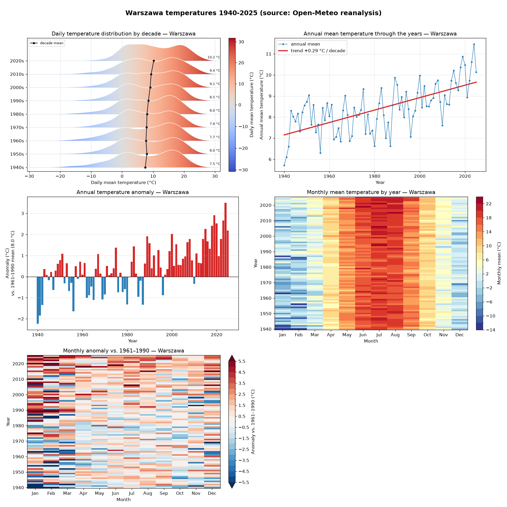

# temperatury

Historical temperature analysis for Polish cities (and any custom lat/lon),
using free [Open-Meteo](https://open-meteo.com/) reanalysis data (daily, from
1940). Produces both the **distribution** of temperatures and how they **change
through the years**.

**🌍 Live site:** https://yasoftwaredev.github.io/temperatury/ (auto-rebuilt from
fresh data on each push and yearly).



## What it makes

A dashboard plus five standalone PNGs in `output/`:

| View | Question it answers |
|------|---------------------|
| **Histogram** | What is the *distribution* of daily temperatures? |
| **Annual trend** | How does the yearly mean change over time? (with °C/decade trend) |
| **Anomaly bars** | How does each year compare to the 1961–1990 norm? (blue = cooler, red = warmer) |
| **Month × year heatmap** | *Which months/seasons* are warming? (discrete 2 °C bands) |
| **Monthly anomaly heatmap** | How much has *each month* shifted vs. its 1961–1990 norm? (seasonal cycle removed, robust scale) |

The histogram intentionally discards the time axis, so it cannot show warming;
the other four views add that missing time dimension. The monthly-anomaly view
normalises each month to its own baseline, so the warming signal stands out
even where the absolute heatmap is dominated by the seasonal cycle.

## Setup

```bash
uv venv .venv
uv pip install --python .venv -r requirements.txt
```

## Usage

```bash
.venv/bin/python main.py                       # Warszawa, 1940..last full year
.venv/bin/python main.py --location krakow     # preset: krakow/gdansk/wroclaw/poznan
.venv/bin/python main.py --all                 # every preset city, linked by a nav bar
.venv/bin/python main.py --lat 48.85 --lon 2.35 --name Paris
.venv/bin/python main.py --start 1980 --end 2024 --refresh
```

The published site (`--all`) builds one page per city with a switcher in the
header; the root `index.html` shows Warszawa.

Downloaded data is cached under `data/`; pass `--refresh` to re-download.

## Layout

- `config.py` — locations, paths, API constants
- `data.py` — download + cache daily temperatures
- `plots.py` — the four plotting functions + dashboard composition
- `report.py` — generates the static HTML page (with the city switcher)
- `main.py` — CLI entry point and summary printout

## Example (Warszawa, 1940–2025)

```
overall mean daily temp : 8.41 °C
warming trend           : +0.29 °C / decade
warmest year            : 2024 (11.46 °C)
coldest year            : 1940 (5.72 °C)
```

Data source: Open-Meteo historical reanalysis (ERA5). Free for non-commercial use.
